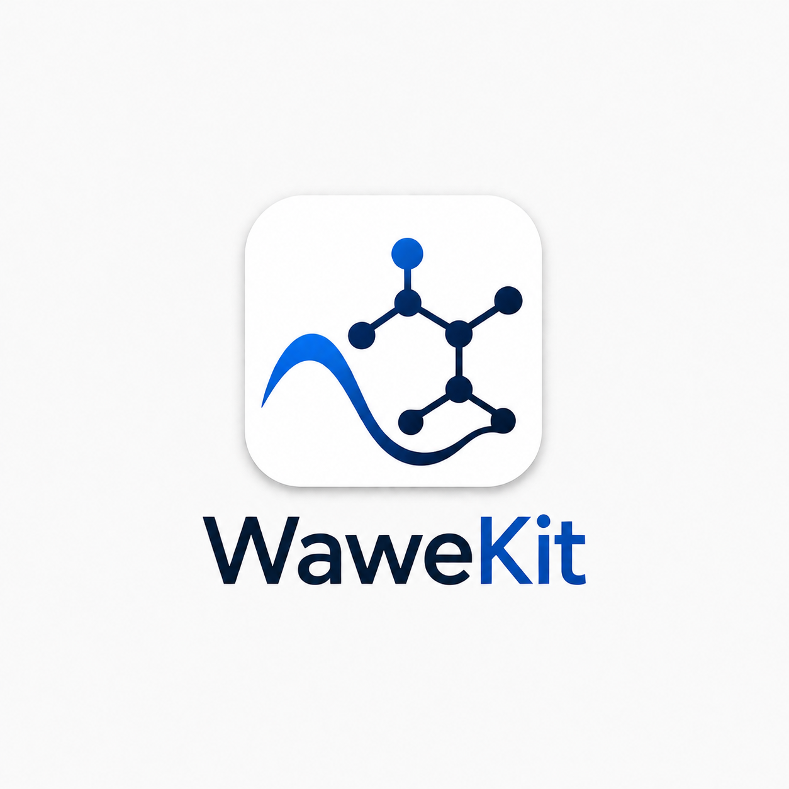

<h1 align="center">
  <br>
  WaweKit
</h1>

<p align="center">
  <b>Open-source desktop cheminformatics toolkit, with a built-in auditor for
  standardization reproducibility</b><br>
  Python 3.12+ &nbsp;•&nbsp; RDKit &nbsp;•&nbsp; PySide6 &nbsp;•&nbsp;
  MIT licensed &nbsp;•&nbsp; Windows / macOS / Linux
</p>

<p align="center">
  <a href="https://github.com/waweai/WaweKit/actions">
    
  </a>
  
  
</p>

---

WaweKit is a native desktop application for cheminformatics and early drug
discovery, built for academic researchers, computational chemists,
pharmaceutical scientists, and students learning the field. Load structures,
clean and standardize them, compute descriptors and fingerprints, search by
similarity or substructure, cluster, project chemical space, generate 3D
conformers, and generate shareable reports — all on background threads, with
no coding, no account, and no data leaving your machine.

Beyond the standard toolkit, WaweKit ships a capability we haven't found in
any other interactive cheminformatics tool: a **standardization reproducibility
auditor** that measures how much your choice of cleanup protocol changes a
dataset's molecular identities, attributes each disagreement to a specific
operation, and can compare your protocols directly against the real production
pipelines that ChEMBL and MolVS run. See [Research flagship](#research-flagship)
below.

## Install

WaweKit installs as a lightweight headless library by default. Add the `[gui]`
extra for the desktop application:

```bash
pip install wawekit          # library + CLI, no Qt
pip install "wawekit[gui]"   # + the desktop application
```

For development:

```bash
python -m venv .venv
# Windows: .venv\Scripts\activate    macOS/Linux: source .venv/bin/activate
pip install -e ".[dev]"      # dev = gui + standardizers + test/lint tooling
```

## Run

```bash
wawekit
# or, equivalently
python -m wawekit
```

The desktop application opens with a branded splash, then the main window. An
illustrated in-app manual is one keypress away (`Help → User Manual`, `F1`).

## Features

| | |
|---|---|
| **Load & convert** | SDF, MOL, SMILES — drag-and-drop or `File → Open`; a standalone format converter (CSV/SDF/MOL/SMILES) |
| **Standardize** | Salt stripping, charge neutralization, tautomer canonicalization, dedup — with a full change report, nothing silent |
| **Analyze** | Descriptors (MW, LogP, TPSA, HBD/HBA, RotB, rings, Lipinski), Morgan/MACCS/RDKit fingerprints, Tanimoto/Dice/Cosine similarity, Bemis–Murcko scaffolds, structural alerts (PAINS/Brenk/NIH) |
| **Explore** | 3D conformer generation (ETKDG + MMFF/UFF) with an interactive viewer, PCA/t-SNE chemical-space projection with linked table selection, Butina/K-Means clustering, SMARTS/SMILES substructure search with atom highlighting |
| **Filter** | A quick-filter box (`MW < 500`, `Sim >= 0.7`) plus an interactive property-range panel |
| **Automate** | A cancellable batch pipeline chaining standardize → descriptors → fingerprints → scaffolds → clustering → export |
| **Report** | Self-contained HTML and paginated PDF reports with embedded depictions |
| **Extend** | A plugin system discovering third-party packages via Python entry points — no fork required |
| **Research** | The standardization-reproducibility auditor — see below |

All 20 build-out modules are complete: architecture, loading, viewing,
standardization, descriptors, fingerprints, similarity, scaffolds, conformers,
chemical space, clustering, substructure search, batch processing, reporting,
settings, plugins, packaging, documentation, CI, and release preparation.
358 automated tests; CI runs lint, format and the full suite on Ubuntu,
Windows and macOS.

## Research flagship

Structure standardization is mandatory in every cheminformatics pipeline, but
the *protocol* used to perform it — which operations, in what order — varies
across tools and configurations, and is rarely reported precisely enough to
reproduce. WaweKit treats standardization reproducibility as a measurable,
first-class property of a dataset rather than an implicit assumption.

`Research → Reproducibility Audit` (`Ctrl+Shift+R`) runs two or more
standardizers over your loaded dataset and reports:

- **Whether they agree**, under two identity conventions (canonical SMILES and
  InChIKey) that can genuinely disagree with each other.
- **Why they don't**, via systematic operation ablation — attributing each
  disagreement to the specific normalization step responsible, not just
  flagging that a disagreement exists.
- **Cross-toolkit comparison.** Standardizers aren't limited to protocols
  composed from RDKit operations — WaweKit ships adapters for **ChEMBL's own
  production curation pipeline** and for **MolVS**, so you can ask directly
  "does my pipeline agree with the one this database runs?"

On a seeded random sample of 4,972 ChEMBL structures, three RDKit-composed
protocols agreed on only **54.1%** of molecules under canonical-SMILES identity
and **57.7%** under InChIKey identity. Comparing against the real production
pipelines found that WaweKit's composed approximation of the ChEMBL pipeline
reproduces the actual pipeline on **99.8%** of structures — and, more
surprisingly, that **two configurations of one standardizer (MolVS) agreed
with each other on only 56.0% of structures, while two independently
developed standardizers agreed on 77.2%** — configuration choice within a
single tool spans a wider range of outcomes than the choice between tools.

A companion downstream-impact study, applying the same audit to 27,152 real
bioactivity measurements across four drug targets, found that aggressive
standardization can silently delete up to 9.5% of a dataset by merging
compounds and fuse activities differing by a thousandfold into single
training labels — while leaving the aggregate metrics normally used to
validate a pipeline statistically unchanged. In short: an unmoved model score
is not evidence that a standardization change was safe.

Two manuscript drafts describing the method and the software are included
under [`learning/`](learning/) in the full development repository, along with
every script, seed and raw result needed to regenerate the figures above from
scratch.

## Architecture

Strict layered design; dependencies point downward only:

```
gui  ->  services  ->  models  ->  core
```

| Layer | Responsibility | Requires Qt? |
|-------|----------------|:---:|
| `core` | config, logging, paths, constants | no |
| `models` | RDKit-backed domain objects | no |
| `services` | chemistry, I/O, reporting, the reproducibility auditor | no |
| `gui` | PySide6 windows, docks and dialogs | yes |

Every analysis service imports without Qt, which is what makes the headless
install possible: `wawekit.services.reproducibility` and friends are usable
as a plain library or from the command line —

```python
from rdkit import Chem
from wawekit.services.reproducibility import analyze_divergence, compute_metrics
from wawekit.services.reproducibility.protocol import DEFAULT_PROTOCOLS

records = [(name, Chem.MolFromSmiles(smi)) for name, smi in my_compounds]
metrics = compute_metrics(analyze_divergence(records, DEFAULT_PROTOCOLS))
print(f"{metrics.inchikey_reproducibility:.1%} reproducible")
```

or unattended:

```bash
python -m wawekit.services.reproducibility.benchmark compounds.smi --out results.csv
```

— without pulling in the desktop UI at all, and the GUI, CLI and library are
verified (by an automated test, not just convention) to compute identical
results for identical input.

## Development

```bash
pytest            # run the test suite
ruff check .      # lint
black .           # format
mkdocs serve      # preview docs
```

## Documentation

- [`docs/FEATURES.md`](docs/FEATURES.md) — what every feature is, why it's
  useful, and how it works internally.
- [`docs/PACKAGING.md`](docs/PACKAGING.md) — building a distributable desktop
  bundle with PyInstaller.
- An illustrated manual ships inside the app itself (`Help → User Manual`).

## Acknowledgements

The interactive 3D conformer viewer is powered by
[3Dmol.js](https://3dmol.csb.pitt.edu/) (BSD-3-Clause), vendored and used
offline — see `src/wawekit/resources/web/NOTICE-3Dmol.txt`. Cross-toolkit
comparison uses the openly released
[ChEMBL structure curation pipeline](https://github.com/chembl/ChEMBL_Structure_Pipeline)
and [MolVS](https://github.com/mcs07/MolVS).

## License

[MIT](LICENSE) © TheWaweAI
